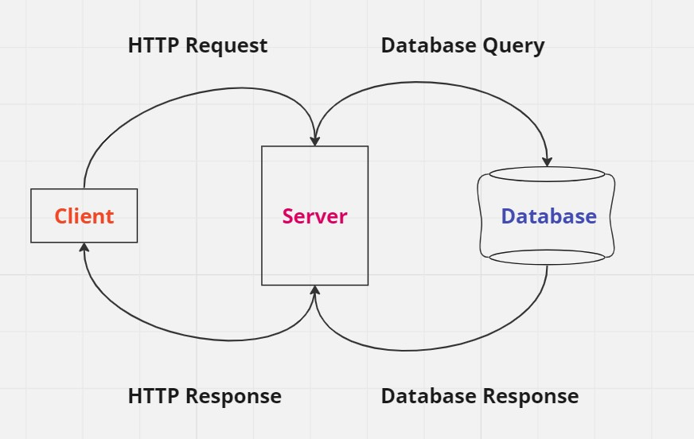

# Movies-Library - version 1.0.0
**Author Name**: Mohamed Yaman Katalan

## WRRC

## Overview
## Node js:
- runtime environment to run js outside the browser

- it uses V8-engine

- we will use it to run our server

## Express js:
- JS framework
- We will use it to build Servers

## steps to build a server using Express:
- `npm init -y` -y: yes

- create `index.js` file, name is optional
-`npm install express` to install express package

- run the server using `node index.js`

## Getting Started
<!-- What are the steps that a user must take in order to build this app on their own machine and get it running? -->

## Project Features
<!-- What are the features included in you app -->